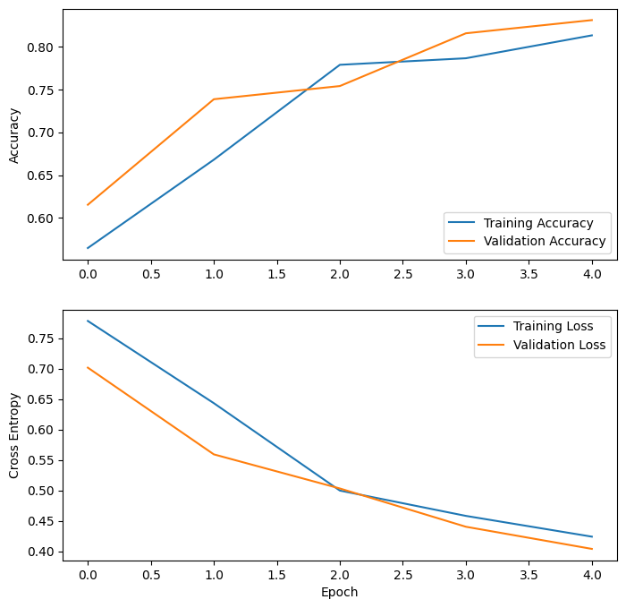
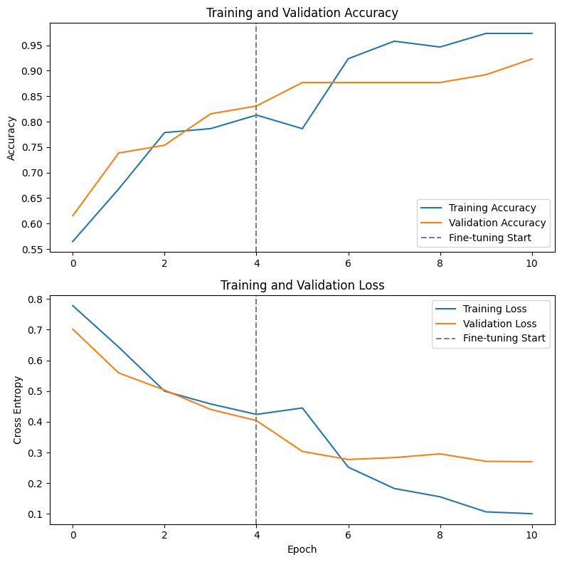
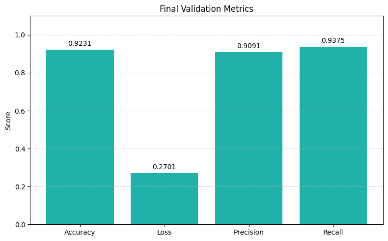

# MobileNetV2 Fine-Tuning for Binary Classification (Alpaca vs Not-Alpaca)

This project demonstrates **transfer learning and fine-tuning using MobileNetV2** on a small binary classification task - distinguishing between Alpaca and Not-Alpaca images.

## 📊 MobileNetV2 Architecture

Below is a visual representation of the MobileNetV2 architecture used in this project:


The goal was not just to train a model, but to deeply understand the full transfer learning pipeline, including:

- Pre-trained model loading
- Feature extraction
- Fine-tuning select layers
- Data augmentation
- Performance tracking

---

## 📁 Directory Structure

```bash
transfer_learning/
├── notebook.ipynb # Full training + fine-tuning workflow
├── dataset/
│ ├── alpaca/ # Alpaca images
│ └── not alpaca/ # Not-Alpaca images
├── images/
│ ├── accuracy_loss_train_val.png # Before fine-tuning
│ ├── ft_acc_loss_train_val.png # After fine-tuning
│ ├── val_metrics.png # Final bar plot of validation metrics
│ └── mobilenetv2.png # Architecture illustration

```


---

## 🚀 What’s Inside

### ✅ Model:
- Base: `MobileNetV2` (ImageNet pretrained, top removed)
- Custom head: `GlobalAveragePooling2D` + `Dropout(0.2)` + `Dense(1, activation='sigmoid')`

### 🧪 Training Pipeline:
- **Data Augmentation** (flips, rotations, rescale)
- **Feature Extraction** (base frozen)
- **Fine-Tuning** (top layers `after 120 layers` of MobileNetV2 unfrozen)
- Optimized with `Adam`, binary crossentropy loss

---

## 📊 Training & Fine-Tuning Results

### ▶️ Before Fine-Tuning:


### 🔁 After Fine-Tuning:


### 📈 Final Validation Metrics:


---

## 🧠 Why This Project Matters

This project was about *doing things the right way*:

- No “black-box” shortcut - every layer was handled intentionally
- Understood how freezing/unfreezing impacts convergence
- Evaluated the effect of fine-tuning using actual metrics and visualizations

This kind of depth is what I aim for in every ML project.

---

## 🛠️ How to Run

1. Clone the repo
2. Put your images inside `dataset/alpaca` and `dataset/not alpaca`
3. Open and run `notebook.ipynb` step-by-step
4. (Optional) Visualize and extend the architecture or export the model

---

## 📌 Tools Used

- TensorFlow / Keras
- Matplotlib
- MobileNetV2 weights (without top)
- Jupyter Notebook

---

## 🤝 Let's Connect

If you're working on transfer learning or deep learning model optimization, I’d love to connect and collaborate. Feel free to fork this repo or open an issue to discuss improvements or ideas!

---

## 👨‍💻 Author

**Nabeel Shan**  
Software Engineering Student @ NUST Islamabad  
Aspiring AI Researcher . AI/ML Enthusiast . Deep Learning Explorer  
🔗 [LinkedIn](https://www.linkedin.com/in/nabeelshan) • [GitHub](https://github.com/nabeelshan78)
> Currently mastering Deep Learning architectures through hands-on work
> Open to research collaborations, open-source contributions, and AI/ML projects.
